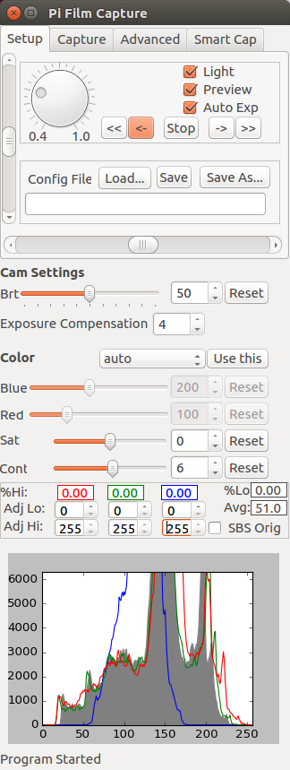
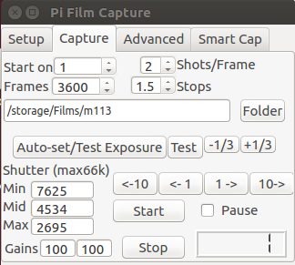

# rpi-film-capture

A project to perform frame-by-frame capture of 8mm and 16mm films using a raspberry pi, the pi camera, and a modified movie projector. 

Design:
* Film transport is via a repurposed projector (8mm, Super8, or 16mm), driven by a stepper motor. 
* Raspberry Pi acts as a headless server, controlling the camera, streaming captured images over a network, and controlling the camera.
* Python 'client' program runs on a higher-power computer on the same network. It sends control commands to the Pi server, and performs processing on images as they are captured.

Optimizations for Speed:
* Streaming images over network reduces I/O delay between frames, compared to saving them locally.
* Multithreading on both client and server further reduces I/O delays.
* All computationally demanding processing (esp. image fusion; see below) is performed by the (faster) client.
* Can capture via the Pi Camera's (slower) stills port, or can blend captures from the video port for increased speed.
* Practical per-frame capture times range from 1.6s/frame for 3-exposure bracketing from still port, down to .5s/frame for single-exposure captures from video port.

Optimizations for Quality:
* Performs exposure bracketing on frames and combine them, to capture a much higher dynamic range than the Pi Camera normally permits.
* Full control over Pi Camera's settings, some of which may be changed mid-capture.
* Some simple histogram adjustment tools can do some processing on captured images before saving.

Optimizations for Usability:
* 'Setup Mode' allows for precise adjustment of camera before starting capture.
* Near-real-time view of captured images.
* Save/load settings, e.g. for different film types or projector setups.
* 'Smart capture' features to adjust to dramatic lighting changes (under development)

* Entire system can be moved between projectors to another to change film gauges.

See the [wiki](https://github.com/jphfilm/rpi-film-capture/wiki)(still under construction) for complete documentation, including a manual, wiring diagrams, and hardware selection tips for your own project.

Demonstration video, samples, and comparison w/ direct capture at speed available on my [YouTube channel](https://www.youtube.com/channel/UCQi6WqZvf4OT9eOhWeVfKMg).

